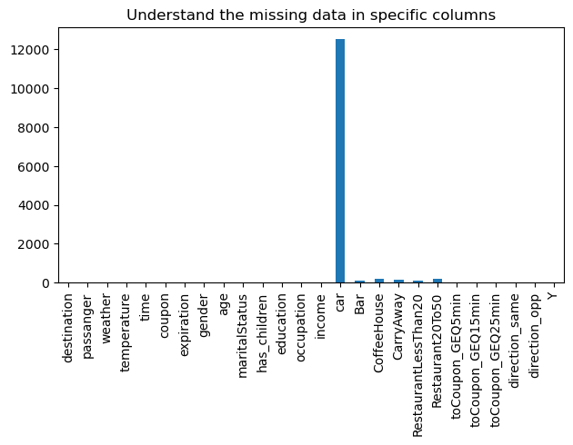

# assignment_5_1
 Assignment 5.1 

 
 **URL:** https://github.com/hegdesan-us/assignment_5_1.git

**Name :** Sanjay Hegde \
**Couse :** UCB AI/ML 

**prompt_orig.ipynb :** Original Prompt file (Questions only)

**prompt_sol.ipynb :** Original Prompt file (Solutions)

**Directory :** Images \
  Description : Contains the images needed for the prompt questions and the Jupyter notebook 

**Directory : data** \
 Description : Contains the data file needed for the class project\
 Contains file : coupons.csv

### Summary of findings
 **Car cloumn is nor really needed. Missing significant information**

 

**Coffee Store Coupon in Demand**

 
  
**Acceptance Rate by Bar Frequency**

 

**Is Morning and evening coupon usage is more?**

 

**Unempoyed and students use coffee coupon more??**

 

**Unempoyed and students use cheap resturent coupon more??**

 

 

 

 
