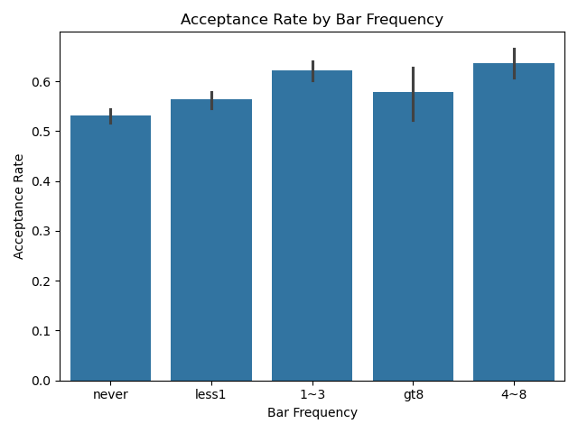
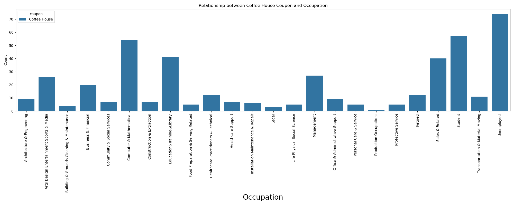

# assignment_5_1
 Assignment 5.1 

 **URL for the assignment:** 
```
https://github.com/hegdesan-us/assignment_5_1.git
```
 **URL for solution Jupyter notebook:** 
```
https://github.com/hegdesan-us/assignment_5_1/blob/f7b71cbf780d21fdf6d1b74635c20a9c32916165/prompt_sol.ipynb
```

**Name :** Sanjay Hegde \
**Couse :** UCB AI/ML 

**prompt_orig.ipynb :** Original Prompt file (Questions only)

**prompt_sol.ipynb :** Final solutions file


**Directory :** Images \
  Description : Contains the images needed for the prompt questions and the Jupyter notebook 

**Directory : data** \
 Description : Contains the data file needed for the class project\
 Contains file : coupons.csv

### Summary of findings
 **Car cloumn is nor really needed. Missing significant information**

 

 **Assumptions made to fill the missing data**
- Assuming that any NaN in Carryway means "less than 1" times people have ordered carry away
- Cleaned the values in Marital Status for easier processing later
- Number of times that he/she goes to a coffee house: for NaN assumes as less than 1
- Number of times that he/she eats at a restaurant with average expense less than $20 per person: Assuming never.
- Number of times that he/she eats at a restaurant with average expense between $20 to 50 per person: Assuming less than 1
- Number of times that he/she goes to a bar: Assuming never
- Car column doesn't contain enough data so dropping the column


**Coffee Store Coupon in Demand**

 
  
**Acceptance Rate by Bar Frequency**

Those who visits the bar 4-8 times per month seems to to have a higher acceptance rate for bar coupon.

 

**Is Morning 8AM and evening 6PM coupon usage is more**

 

**Unempoyed and students use coffee coupon more**

 

**Unempoyed and students use cheap resturents coupon more**

 


**Based on the observations, we can hypothesize that drivers who accepted the bar coupons:**

 1. Are more likely to frequent bars: Those who go to bars more frequently (more than once a month)
    tend to have a higher acceptance rate for bar coupons.
 2. Are more likely to be older and have a certain occupation
   (e.g., not farming, fishing, or forestry): Acceptance rate was higher in drivers who go to a bar more than once a month and are over 25

**Next steps**

- Explore factors like Gender, Distance, Direction and combination of those factors influencing coupon acceptance


 

 
